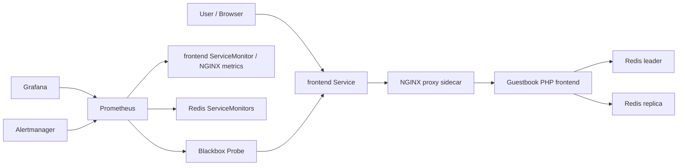

# Guestbook Monitoring with Pulumi, Prometheus, and Grafana

This project extends the Pulumi Kubernetes Guestbook example with production-style monitoring and operational safeguards.

It deploys:

- Guestbook frontend, Redis leader, and Redis replica services.
- `kube-prometheus-stack` with Prometheus, Grafana, Alertmanager, and Prometheus Operator CRDs.
- Redis exporters for backend metrics.
- NGINX proxy and NGINX exporter sidecars for frontend request metrics.
- `ServiceMonitor` resources for frontend, Redis leader, and Redis replica scraping.
- A Blackbox Exporter `Probe` for frontend availability.
- Prometheus alert rules for frontend availability, Redis availability, and high CPU.
- Grafana dashboard provisioning from `dashboards/guestbook-overview.json`.
- Resource requests, limits, readiness/liveness/startup probes, HPA, PDBs, ResourceQuota, LimitRange, and NetworkPolicy resources.

## Architecture



## Prerequisites

- Kubernetes cluster available through the current `kubectl` context.
- Pulumi CLI.
- Node.js and npm.
- Helm chart access to `https://prometheus-community.github.io/helm-charts`.
- For local testing, Minikube or Docker Desktop Kubernetes works well.

For Minikube or Docker Desktop, keep `isMinikube=true`. For cloud clusters, set it to `false` to use LoadBalancer services.

## Deploy

```bash
npm install
pulumi stack init dev
pulumi config set isMinikube true
pulumi config set --secret grafanaAdminPassword 'change-me'
pulumi preview
pulumi up
```

For a cloud cluster:

```bash
pulumi config set isMinikube false
pulumi up
```

Versioned components can be overridden without editing code:

```bash
pulumi config set kubePrometheusStackVersion 86.1.0
pulumi config set redisExporterImage oliver006/redis_exporter:v1.62.0
pulumi config set blackboxExporterImage prom/blackbox-exporter:v0.25.0
pulumi config set nginxExporterImage nginx/nginx-prometheus-exporter:1.3.0
```

## Access Grafana

Pulumi exports:

- `grafanaUrl`
- `grafanaUsername`
- `grafanaServiceSelectorOutput`
- `grafanaNamespace`
- `grafanaPortForwardCommand`
- `grafanaPasswordSecretCommand`

The Grafana password is intentionally not exported as a plain stack output. Retrieve it from the Kubernetes Secret:

```bash
pulumi stack output grafanaPasswordSecretCommand
```

Or run the selector-based command directly. This works even when Helm adds a generated suffix to the Grafana Secret:

```bash
kubectl -n monitoring get secret -l app.kubernetes.io/name=grafana,app.kubernetes.io/component=admin-secret -o jsonpath='{.items[0].data.admin-password}' | base64 --decode
```

For local clusters, keep this port-forward command running while using Grafana:

```bash
kubectl -n monitoring port-forward svc/$(kubectl -n monitoring get svc -l app.kubernetes.io/name=grafana -o jsonpath='{.items[0].metadata.name}') 3000:80
```

Then open:

```text
http://localhost:3000
```

If `localhost:3000` says connection refused, the port-forward command is not running or the Grafana pod is not ready yet.

## Access the Guestbook

For local clusters, keep this port-forward command running while using the app:

```bash
kubectl -n guestbook port-forward svc/frontend 8080:80
```

Then open:

```text
http://localhost:8080
```

If `localhost:8080` says connection refused, the port-forward command is not running or the frontend pod is not ready yet.

## Verify Prometheus Scraping

Port-forward Prometheus:

```bash
kubectl -n monitoring port-forward svc/$(kubectl -n monitoring get svc -l app=kube-prometheus-stack-prometheus -o jsonpath='{.items[0].metadata.name}') 9090:9090
```

Open `http://localhost:9090/targets` and check for:

- `serviceMonitor/monitoring/frontend`
- `serviceMonitor/monitoring/redis-leader`
- `serviceMonitor/monitoring/redis-replica`
- `probe/monitoring/guestbook-frontend`

Useful Prometheus queries:

```promql
up{namespace="guestbook"}
nginx_http_requests_total{namespace="guestbook"}
sum(rate(nginx_http_requests_total{namespace="guestbook"}[5m]))
redis_up{namespace="guestbook"}
redis_connected_clients{namespace="guestbook"}
probe_success{job="guestbook-frontend"}
sum by (pod) (rate(container_cpu_usage_seconds_total{namespace="guestbook",container!="",pod!=""}[5m]))
sum by (pod) (container_memory_working_set_bytes{namespace="guestbook",container!="",pod!=""})
```

## Verify Kubernetes Resources

```bash
kubectl get pods -n guestbook
kubectl get pods -n monitoring
kubectl get servicemonitor -A
kubectl get prometheusrule -A
kubectl get hpa -n guestbook
kubectl get pdb -A
kubectl get resourcequota,limitrange -A
kubectl get networkpolicy -A
```

## Dashboard

Grafana automatically imports the `Guestbook Overview` dashboard from `dashboards/guestbook-overview.json`.

The dashboard shows:

- Frontend HTTP probe status.
- Frontend request rate from NGINX exporter metrics.
- Guestbook pod CPU usage.
- Guestbook pod memory usage.
- Redis connected clients from Redis exporter metrics.

## Notes

The original `pulumi/guestbook-php-redis` frontend image does not expose native Prometheus application metrics. To provide a real frontend request counter without rebuilding the application image, this implementation adds an NGINX proxy sidecar plus `nginx-prometheus-exporter`. Prometheus scrapes those frontend metrics with a `ServiceMonitor`.

Blackbox Exporter is still used separately for user-facing HTTP availability, which complements the request counter and Kubernetes resource metrics.

## Cleanup

```bash
pulumi destroy
pulumi stack rm dev
```

## References

- Pulumi Guestbook example: <https://github.com/pulumi/examples/tree/master/kubernetes-ts-guestbook>
- kube-prometheus-stack Helm chart: <https://github.com/prometheus-community/helm-charts/tree/main/charts/kube-prometheus-stack>
- Prometheus Operator custom resources: <https://prometheus-operator.dev/docs/api-reference/api/>
